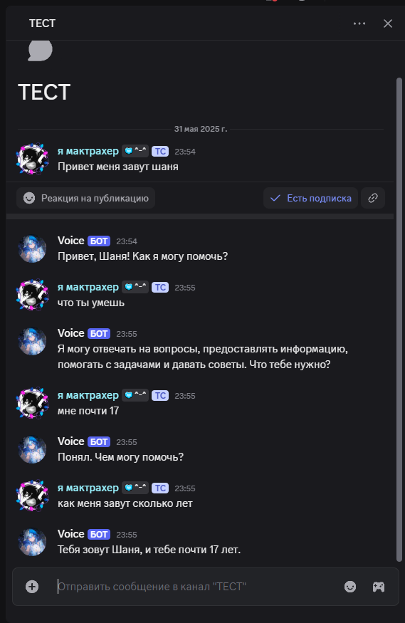

# Discord AI Бот


## 📋 Описание
Дискорд бот с интеграцией Mistral AI, поддержкой отдельных диалогов в тредах и сохранением истории сообщений.

## 🔧 Основные возможности

- Отдельный диалог в каждом треде через discord.Thread
- Постоянная память (история чатов) через MySQL
- Интеграция с Mistral AI

## 📦 Требования

- Python 3.8+
- MySQL Server
- Discord Bot Token
- Mistral AI API Key

## ⚙️ Установка

1. Клонируйте репозиторий
2. Установите зависимости:
   ```bash
   pip install -r requirements.txt
   ```
3. Настройте .env файл:
   ```env
    MISTRAL_API_KEY="свой"
    TOKEN="свой"

    MYSQL_HOST_0=localhost
    MYSQL_USER_0=root
    MYSQL_PASSWORD_0=свой
    MYSQL_DATABASE_0=discord_bot_shard_0

    MYSQL_HOST_1=localhost
    MYSQL_USER_1=root
    MYSQL_PASSWORD_1=свой
    MYSQL_DATABASE_1=discord_bot_shard_1
    FORUM_CHANNEL_ID="свой"
5. Запустите бота:
```bash
python bot.py
```

## 🚀 Использование

1. Добавьте бота на ваш сервер
2. Создайте форум-канал и укажите его ID в .env
3. Создавайте треды в форуме для общения с ботом

## 📁 Структура проекта

- `bot.py` - основной файл бота
- `ai.py` - интеграция с Mistral AI
- `db.py` - работа с MySQL
- `.env` - конфигурация
- `requirements.txt` - зависимости
